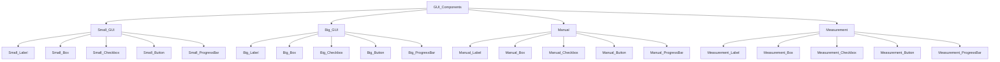

```mermaid
graph TD;
  GUI_Components --> Small_GUI
  GUI_Components --> Big_GUI
  GUI_Components --> Manual
  GUI_Components --> Measurement
  Small_GUI --> Small_Label
  Small_GUI -->  Small_Box
  Small_GUI --> Small_Checkbox
  Small_GUI --> Small_Button
  Small_GUI --> Small_ProgressBar
  Big_GUI --> Big_Label
  Big_GUI --> Big_Box
  Big_GUI --> Big_Checkbox
  Big_GUI --> Big_Button
  Big_GUI --> Big_ProgressBar
  Manual --> Manual_Label
  Manual --> Manual_Box
  Manual --> Manual_Checkbox
  Manual --> Manual_Button
  Manual --> Manual_ProgressBar
  Measurement --> Measurement_Label
  Measurement --> Measurement_Box
  Measurement --> Measurement_Checkbox
  Measurement --> Measurement_Button
  Measurement --> Measurement_ProgressBar
```
